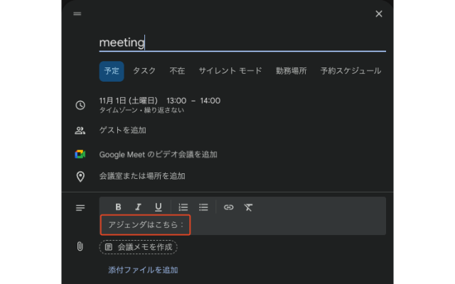

# no-agenda-no-mtg

**Promote better meetings, one agenda at a time.**

Download it [here](https://chromewebstore.google.com/detail/no-agenda-no-mtg/fpjonpnfniocemcpjdepablfpjmabjfa?authuser=1&hl=ja).

## Overview

**no-agenda-no-mtg** is a Chrome extension that helps you build a better meeting culture.
When you create a Google Calendar event with `meetintg` or `mtg` in the title,
it automatically inserts the text `アジェンダはこちら：` (in English: `Agenda here:`) in the description field.

**Mission:**
> If a meeting has no agenda, it shouldn’t exist.

https://github.com/user-attachments/assets/b5d8655a-eb77-4014-890f-11e52fc2803e

## Features

- Detects when the event title contains `mtg` or `meetintg`  (or any custom keyword you set)
- Automatically inserts your preferred text into the empty description field
- Keywords and inserted text are fully customizable via the options page

## Privacy

- No external communication
- No data collection or tracking
- Runs only on `https://calendar.google.com/*`

## Contributing

Pull requests and ideas are welcome.
